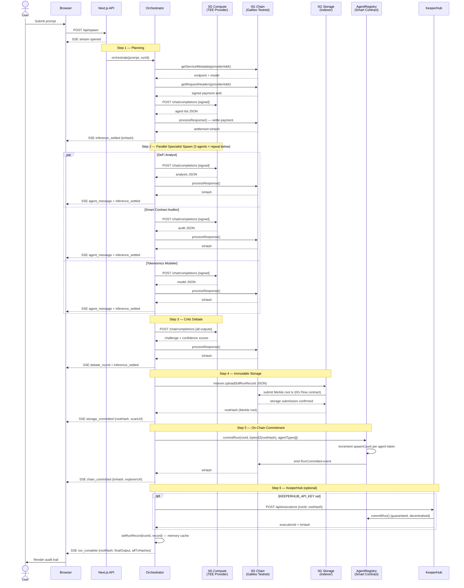

# Orcha-net

> **Describe what needs to be done. Watch a network of specialized agents spawn, compete, and prove every step on-chain.**

Orcha-net is a decentralized agent-spawning network where a user's intent triggers an orchestrator that autonomously spawns specialized sub-agents, routes them through on-chain settled inference (0G Compute TEEs), has them debate via a critic layer, stores the immutable reasoning chain on 0G Storage, and surfaces every transaction hash, root hash, and iNFT state change as a live, clickable audit trail.

---

## Full Technical Flow

> **Short answer: yes, you've got it right.** But there are two critical layers most people miss — both inside what looks like a single "inference call."

### What happens when you submit a chat prompt

```
POST /api/spawn  →  SSE stream  →  orchestrate()
```

The moment you hit send, a **Server-Sent Events (SSE)** stream opens from your browser to the Next.js API route. The orchestrator runs server-side and emits events as each step completes. Here is the full sequence in order:

---

### Step 1 — Planning Pass (1 inference + 1 on-chain settlement)

The **Orchestrator** agent reads your prompt and decides which specialist agents to spawn. This itself is a full 0G Compute inference call:

1. `broker.inference.getServiceMetadata(providerAddr)` → fetches the provider's endpoint URL and model name **from the on-chain service registry** (0G Galileo Testnet)
2. `broker.inference.getRequestHeaders(providerAddr)` → generates a **cryptographically signed payment authorisation** that proves a pre-funded ledger exists between your wallet and this provider
3. HTTP `POST /chat/completions` → actual LLM call to the provider's TEE endpoint
4. `broker.inference.processResponse(providerAddr, responseId, usage)` → **settles the payment on-chain**, debits tokens from your compute ledger, emits a settlement txHash

**SSE events emitted:** `agent_message` (planning), `inference_settled` (with txHash)

---

### Step 2 — Parallel Specialist Spawn (N inferences + N settlements, concurrent)

All selected agents run **simultaneously** via `Promise.all()`. Each agent independently:

- Emits `agent_spawned` with its ENS subname (e.g. `defi-analyst.orchanet.eth`)
- Runs the full 4-step inference + settlement cycle above
- Has its own system prompt (stored on 0G Storage — those root hashes from the seed script)
- Up to **3 retry attempts** with exponential backoff (1.5s, 3s) if the provider is busy

**SSE events emitted per agent:** `agent_spawned`, `inference_started`, `inference_settled` (txHash), `agent_message` (LLM output)

---

### Step 3 — Critic Debate (1 more inference + 1 settlement)

The **Critic** agent receives all specialist outputs concatenated. Its system prompt instructs it to:
- Identify the weakest unsupported claim across all outputs
- Issue a specific counter-argument
- Assign a confidence score to each agent

**SSE events emitted:** `agent_spawned`, `inference_settled` (txHash), `debate_round`

---

### Step 4 — 0G Storage Commit (Merkle upload → rootHash)

The **entire run record** — prompt, all agent outputs, all events, all txHashes, timestamps — is serialised as JSON and uploaded to 0G Storage:

1. `MemData(bytes)` wraps the JSON in memory
2. `indexer.upload(memData, rpcUrl, signer)` splits into chunks, computes a **Merkle tree**
3. A **submission transaction** is posted on-chain (0G Flow contract) registering the Merkle root
4. Storage nodes replicate the data and submit availability proofs
5. The **root hash** (keccak256 Merkle root) is returned — this is the permanent content address

The root hash is cryptographically bound to every byte of the run record. Any tampering changes the hash. It is **permanently retrievable** by anyone who has the root hash.

**SSE events emitted:** `storage_committed` (rootHash), `storage_info` (StorageScan URL)

---

### Step 5 — On-Chain Commitment (AgentRegistry.commitRun)

`AgentRegistry.commitRun(runId, bytes32(rootHash), agentTypes[])` is called directly on 0G Galileo Testnet:

- Links the run ID to the 0G Storage root hash **permanently on-chain**
- Increments `spawnCount` for each participating agent token (ERC-7857-style)
- Emits `RunCommitted` event (indexed, queryable forever)
- Protected against double-commitment via `runIdToIndex` mapping

**SSE events emitted:** `storage_committed` (AgentRegistry txHash), `chain_committed` (explorerUrl)

---

### Step 6 — KeeperHub Settlement (optional, if configured)

If `KEEPERHUB_API_KEY` and `KEEPERHUB_WORKFLOW_ID` are set, a KeeperHub workflow is triggered via REST API (`POST /api/executions`). This provides **guaranteed settlement** — even if your server goes down, the keeper network will execute `commitRun()` autonomously on a schedule. This is the decentralised automation layer.

---

### Step 7 — Memory Store + run_complete

The full run record is persisted in-process (Map) for fast O(1) retrieval by `/api/runs/[runId]`. The `run_complete` SSE event fires with the final rootHash, all txHashes, duration, and the compiled report.

---

### What you missed (or didn't see)

There are two things that happen **invisibly** before any of this works:

> **A — Compute Ledger Pre-funding**
> Before the first inference call, your wallet must have deposited A0GI into a **compute payment channel** with the provider. The broker SDK manages this ledger. Without a funded ledger, `getRequestHeaders()` fails. This is why `ZG_PRIVATE_KEY` must point to a wallet with testnet A0GI.

> **B — Every inference call has TWO on-chain transactions**
> First: the provider node reads your signed payment header (off-chain auth). Second: after the response is returned, `processResponse()` posts the settlement on-chain — this is the txHash you see in the UI. So for a 3-agent + 1-critic + 1-planning run, you get **5 settlement txHashes** plus **1 storage submission tx** plus **1 commitRun tx** = **7 on-chain transactions per chat message.**

---

## Sequence Diagram



---

## On-Chain Proof Chain Per Run

Every run produces this **verifiable chain of evidence**, all publicly queryable:

| # | What | Where | How to verify |
|---|------|--------|----------------|
| 1 | Planning inference settled | 0G Chain | txHash in `inference_settled` event |
| 2–4 | Specialist agent inferences settled | 0G Chain | txHash per `inference_settled` event |
| 5 | Critic debate inference settled | 0G Chain | txHash in `debate_round` event |
| 6 | Full run record uploaded | 0G Storage | `storagescan.0g.ai/file?rootHash=<hash>` |
| 7 | Run committed to registry | 0G Chain | `chainscan-galileo.0g.ai/tx/<txHash>` |

---

## Deployed Contracts

| Contract | Address | Network |
|----------|---------|---------|
| AgentRegistry | [`0xB6061bC7489bDAe71cAeFd8d86A5800a78fa9bE9`](https://chainscan-galileo.0g.ai/address/0xB6061bC7489bDAe71cAeFd8d86A5800a78fa9bE9) | 0G Galileo Testnet (chainId 16602) |

## Agent Registry (on 0G Storage)

| Agent | ENS | Storage Root Hash |
|-------|-----|------------------|
| DeFi Analyst | `defi-analyst.orchanet.eth` | [`0xbacf...ec7`](https://storagescan.0g.ai/file?rootHash=0xbacf411b30ea702d261cb7af0cff85b96667393f68cfbe332c1b0bdc4437fec7) |
| Smart Contract Auditor | `auditor.orchanet.eth` | [`0xbd8b...33d`](https://storagescan.0g.ai/file?rootHash=0xbd8b704e5a03c9e028c4ab0ce5160dd0c69bfaed4ba84a8f83d75f4d14ae833d) |
| Tokenomics Modeler | `tokenomics.orchanet.eth` | [`0x6c4a...a4`](https://storagescan.0g.ai/file?rootHash=0x6c4a138a736b2a1bde2a3ed0a8c4cb36d5ab599ed65e3a22058cb69ff6eea7a4) |
| Critic | `critic.orchanet.eth` | [`0xb0d1...41`](https://storagescan.0g.ai/file?rootHash=0xb0d1987807ea4e33d1869ff527fbdcf98f953f14660e7dd4cb17cc4ecf2e7341) |

---

## Stack

- **Frontend**: Next.js 16 (App Router) · TypeScript · Turbopack
- **Contracts**: Solidity 0.8.24 · Hardhat · 0G Galileo Testnet (chainId 16602)
- **Inference**: `@0gfoundation/0g-compute-ts-sdk` — TEE-verified on-chain settlement
- **Storage**: `@0gfoundation/0g-storage-ts-sdk` — immutable Merkle-rooted reasoning chains
- **Identity**: ENS subnames + ERC-7857-inspired iNFT agent registry
- **Settlement**: KeeperHub REST API — optional guaranteed on-chain run commitment
- **Fonts**: Space Grotesk · Space Mono

## Quick Start

```bash
cd frontend
npm install
npm run dev                     # → http://localhost:3000

# Discover live 0G Compute providers
npm run providers               # list
npm run providers:update        # auto-update ZG_PROVIDER_DEFAULT in .env.local

# Contracts (already deployed)
cd contracts
npm run deploy                  # redeploy AgentRegistry
npm run register                # reseed agents (uploads prompts to 0G Storage)
```

## Environment Variables

```env
# Required
ZG_PRIVATE_KEY=                         # wallet with testnet A0GI
ZG_RPC_URL=https://evmrpc-testnet.0g.ai
ZG_PROVIDER_DEFAULT=0xa48f01287233509FD694a22Bf840225062E67836  # Qwen 2.5 7B
NEXT_PUBLIC_AGENT_REGISTRY_ADDRESS=0xB6061bC7489bDAe71cAeFd8d86A5800a78fa9bE9
ZG_INDEXER_RPC=https://indexer-storage-testnet-turbo.0g.ai

# Optional (OpenAI-compatible key path — faster, same settlement)
ZG_SERVICE_URL=
ZG_API_SECRET=

# Optional (guaranteed settlement)
KEEPERHUB_API_KEY=
KEEPERHUB_WORKFLOW_ID=
```
