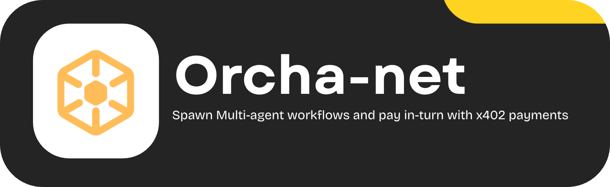
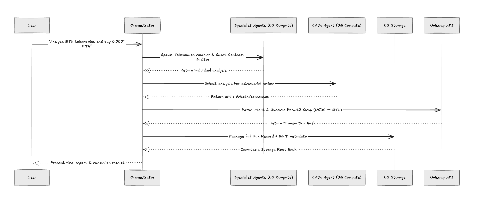
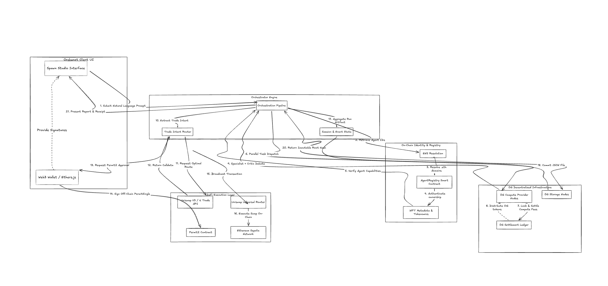

# Orchanet

> **Spawn High-Performance Agents. Execute Trustless Inference.**

Orchanet is a decentralized multi-agent AI orchestration protocol built entirely on the **0G Network**. It solves the fundamental trust problem in AI-driven applications: there is currently no way to verify *how* an AI reached its conclusion, *who* ran the inference, or *whether* the output was tampered with. Orchanet solves this by treating every AI inference task as a first-class on-chain event, anchored by 0G's infrastructure at every layer of the pipeline — from compute dispatch and fee settlement, to immutable storage provenance and on-chain agent identity.

Every agent spawned by Orchanet runs on **0G Compute provider nodes**. Every run record is sealed permanently on **0G Storage**. Every agent identity is verified against an on-chain **AgentRegistry** smart contract. This is not a shallow integration — 0G is the bedrock on which Orchanet's trustlessness is built.

---

## Architecture & Workflow

### Orchestration Pipeline



### System Architecture



---

## The Problem

### AI is a Black Box. That's Unacceptable in Web3.

The DeFi and Web3 ecosystem is increasingly relying on AI for analysis, strategy, and decision support. But every existing AI integration shares the same fatal flaw: you cannot verify the reasoning. A single model hallucinating under load, serving a stale cached response, or running on a compromised centralized server is indistinguishable from a model running correctly. There is no cryptographic proof. There is no audit trail. There is no accountability.

This is the black-box problem — and in a trustless ecosystem built on cryptographic guarantees, it is an existential contradiction.

Orchanet is the answer. By routing every inference task through the **0G Compute network**, committing every reasoning artifact to **0G Storage**, and verifying every agent identity on-chain, we transform AI from an opaque oracle into a fully verifiable, auditable, and trustless intelligence layer.

---

## The Solution: Orchanet on 0G

Orchanet orchestrates a committee of specialized AI agents — a Tokenomics Modeler, Smart Contract Auditor, and an adversarial Critic — that debate a user's prompt in parallel, reach a cryptographically verifiable consensus, and seal the entire reasoning process permanently on the 0G Network.

The result is AI inference that is:
- **Trustless:** No centralized server. Compute is dispatched to 0G provider nodes.
- **Verifiable:** Every output, debate, and consensus score is immutably stored on 0G Storage with a `rootHash`.
- **Accountable:** Agent identities are registered on-chain. Fee settlements flow through the 0G Ledger in OG tokens.
- **Auditable:** Any user can retrieve their run artifact from 0G Storage at any time using the `rootHash`.

---

## 0G Network Integration — Deep Dive

Orchanet treats the 0G Network not as a single feature, but as its entire infrastructure stack. Below is a complete technical breakdown of every 0G integration in the codebase.

---

### 🧠 0G Compute — The Intelligence Layer

**File:** `frontend/lib/0g/compute.ts`
**SDK:** `@0gfoundation/0g-compute-ts-sdk`

This is where Orchanet's intelligence lives. Rather than routing LLM calls to a centralized API endpoint, every inference task in the Orchanet pipeline is dispatched through the **0G Compute SDK** to decentralized provider nodes. The 0G Compute network operates on a **performance-based quality model**: provider nodes compete to serve inference requests, and the protocol's economic incentives ensure that high-quality, low-latency responses are prioritized.

**How the Compute client is initialized:**
```typescript
// frontend/lib/0g/compute.ts
import { ZGServingUserBrokerBase } from '@0gfoundation/0g-compute-ts-sdk'

const broker = await createZGComputeNetworkBroker(
  wallet,
  process.env.ZG_LEDGER_ADDRESS!
)
```

**How inference is dispatched to a 0G provider node:**
```typescript
// Selecting a verified provider and running inference
const provider = await broker.modelProcessor.selectProvider(model, 'model')
const { endpoint, model: selectedModel } = await broker.getServiceMetadata(provider)

const response = await fetch(`${endpoint}/chat/completions`, {
  method: 'POST',
  headers: {
    'Content-Type': 'application/json',
    Authorization: `Bearer ${broker.getRequestHeaders(provider)}`,
  },
  body: JSON.stringify({
    model: selectedModel,
    messages: [{ role: 'user', content: prompt }],
    max_tokens: opts.maxTokens ?? 1024,
  }),
})
```

The Orchestrator dispatches agent tasks in **parallel** using `Promise.all`, saturating multiple 0G compute provider nodes simultaneously. This means a 3-agent committee (Tokenomics Modeler + Smart Contract Auditor + Critic) all run their inference concurrently, dramatically reducing total pipeline latency while ensuring each agent's output is independently computed on a separate provider node — eliminating correlated failures.

**Token usage tracking per inference:**
```typescript
const usage = response.usage ?? { prompt_tokens: 0, completion_tokens: 0 }
// Tracked per-agent and reported back to the orchestrator
return {
  content: choice.message.content,
  promptTokens: usage.prompt_tokens,
  completionTokens: usage.completion_tokens,
  provider,
  model: selectedModel,
}
```

Every token consumed by every agent is tracked granularly. This data feeds directly into the 0G Ledger settlement flow, ensuring fair economic accounting for every inference call made during a pipeline run.

---

### 💸 0G Settlement Ledger — The Economic Layer

**File:** `frontend/lib/0g/compute.ts`, `frontend/lib/orchestrator/index.ts`

The 0G Settlement Ledger is what makes decentralized compute economically sustainable. Every inference request dispatched to a 0G provider node carries a cost, denominated in **OG tokens**, that is settled on-chain through the ledger contract. Orchanet's Orchestrator manages this settlement flow automatically.

**Auto-funding logic before each pipeline run:**
```typescript
// frontend/lib/orchestrator/index.ts
const unsettledFee = await broker.ledger.getUnsettledFee(providerAddress)
const requiredBalance = LEDGER_MIN_BALANCE + unsettledFee

const lockedFund = await broker.ledger.getLockedFund(providerAddress)
if (lockedFund < requiredBalance) {
  await broker.ledger.addLedger(providerAddress, requiredBalance - lockedFund)
  console.log(`[Auto-funding] Topped up ledger by ${requiredBalance - lockedFund} OG`)
}
```

Before every run, the Orchestrator:
1. Queries the provider's current **unsettled fee** balance from the ledger contract.
2. Calculates the **minimum required locked balance** (`LEDGER_MIN_BALANCE + unsettledFee`).
3. Compares against the current **locked fund** for the provider.
4. If underfunded, **automatically tops up** the ledger with OG tokens from the Orchestrator wallet.

This guarantees that the pipeline never stalls mid-inference due to an underfunded ledger — a subtle but critical engineering requirement for production-grade decentralized compute.

**Fee distribution after inference:**
```typescript
// After each agent inference call completes
await broker.ledger.processResponse(provider, response, sig)
// OG tokens flow from Orchestrator → 0G Provider Node
```

The `processResponse` call handles the cryptographic verification of the inference response and triggers the OG token transfer to the provider node. This is the moment where **trustless payment for trustless compute** occurs — no escrow, no intermediary, no trust assumption.

---

### 🗄️ 0G Storage — The Provenance Layer

**File:** `frontend/lib/0g/storage.ts`
**SDK:** `@0gfoundation/0g-js-sdk`

0G Storage is the cornerstone of Orchanet's verifiability guarantees. Once the agent committee finishes debating and a consensus is reached, the Orchestrator compiles a complete **Run Record** — a structured JSON artifact containing every piece of reasoning, every agent output, and every on-chain receipt from the entire pipeline. This artifact is then uploaded to the **0G Storage network**.

**The Run Record structure committed to 0G Storage:**
```typescript
const runRecord = {
  runId,
  prompt,                    // Original user query
  status: 'complete',
  agentsSpawned: agentTypes.length,
  inferenceCalls,            // Total 0G Compute calls made
  storageBytesCommitted,     // Artifact size in bytes
  duration: Date.now() - startTime,
  timestamp: startTime,
  finalOutput,               // Full agent debate transcript
  events,                    // All pipeline events (spawned, debated, stored)
  iNFTIdentities: iNFTSnapshot, // On-chain agent identity snapshots
  rootHash: '',              // Filled after 0G Storage upload
  storageTxHash: '',         // 0G Storage transaction hash
}
```

**How artifacts are uploaded to 0G Storage nodes:**
```typescript
// frontend/lib/0g/storage.ts
import { ZgFile, Indexer } from '@0gfoundation/0g-js-sdk'

const zgFile = await ZgFile.fromBuffer(
  Buffer.from(JSON.stringify(artifact)),
  'application/json'
)

// Compute Merkle tree for the artifact
const [tree, treeErr] = await zgFile.merkleTree()
const rootHash = tree.rootHash()

// Submit to 0G Storage indexer → dispersed to storage nodes
const indexer = new Indexer(process.env.ZG_INDEXER_RPC!)
const [txHash, uploadErr] = await indexer.upload(
  zgFile,
  process.env.ZG_STORAGE_RPC!,
  zgSigner,
  { expectedReplica: 1, finalityRequired: true }
)
```

The upload flow involves:
1. **Serialization:** The Run Record JSON is serialized to a buffer.
2. **Merkle tree construction:** `ZgFile.merkleTree()` computes the full Merkle tree over the artifact's chunks, producing an immutable `rootHash` that cryptographically commits to the artifact's content.
3. **Submission to the indexer:** The indexer coordinates with available storage nodes to fragment the data and distribute replicas across the network.
4. **Finality confirmation:** With `finalityRequired: true`, the upload blocks until the 0G Storage network confirms that the data has been persisted and is retrievable.

The resulting `rootHash` is displayed directly in the Orchanet Studio UI and embedded into the Run Record itself — giving users a permanent, tamper-evident cryptographic fingerprint of the entire AI reasoning session.

**What the Storage transaction looks like in the logs:**
```
Starting upload for file of size: 16718 bytes
File details - size: 16718, numSegments: 1, numChunks: 66
Data prepared to upload root=0x453b41bbda1d8707668690944117a26be3863f791622d9458ab47764d746a02e
Submitting transaction with storage fee: 2212822437264n
Transaction submitted, hash: 0x771de5c87b5e946ba532d1ff9efa3c44c369032a844f079451320c0b1a191e3e
Waiting for storage node to sync (height=31301700)...
Single file upload completed
```

The `numChunks: 66` represents the artifact being split into 66 fixed-size chunks across the 0G storage segment structure. Each chunk is individually hashed and committed to the Merkle tree, making it impossible to alter any part of the artifact without invalidating the `rootHash`.

---

### 🔐 AgentRegistry Smart Contract — The Identity Layer

**File:** `frontend/lib/0g/agentIdentity.ts`

Each AI agent in Orchanet is not just a prompt template — it is a registered **Intelligent NFT (iNFT)** on-chain. Before any agent is allowed to participate in a pipeline run, the Orchestrator queries the `AgentRegistry` smart contract to verify the agent's on-chain identity.

**The AgentRegistry ABI (relevant functions):**
```typescript
const AGENT_REGISTRY_ABI = [
  'function getAgentByType(string agentType) external view returns (tuple(uint256 tokenId, string agentType, string ensName, bytes32 metadataHash, string storageRootHash, address owner, uint256 spawnCount, uint256 registeredAt, bool active))',
  'function getAgent(uint256 tokenId) external view returns (tuple(...))',
  'function incrementSpawnCount(uint256 tokenId) external',
]
```

**Identity verification during orchestration:**
```typescript
// frontend/lib/0g/agentIdentity.ts
const contract = new ethers.Contract(AGENT_REGISTRY_ADDRESS, AGENT_REGISTRY_ABI, provider)
const agent = await contract.getAgentByType(agentType)

// Verify the metadata hash: keccak256(agentType + ensName + storageRootHash)
const computedHash = ethers.keccak256(
  ethers.toUtf8Bytes(`${agent.agentType}${agent.ensName}${agent.storageRootHash}`)
)
const verified = computedHash === agent.metadataHash
```

The `metadataHash` is a `keccak256` commitment that ties together the agent's `agentType`, its human-readable name, and the `storageRootHash` of its original model specification artifact stored on 0G Storage. If any of these values are tampered with, the hash check fails and the agent is rejected from the pipeline.

**The iNFT identity snapshot included in every Run Record:**
```typescript
// Captured at the end of every pipeline run
iNFTSnapshot[agentType] = {
  tokenId:         identity.tokenId,        // On-chain NFT token ID
  metadataHash:    identity.metadataHash,   // keccak256 identity proof
  storageRootHash: identity.storageRootHash,// 0G Storage root of agent spec
  spawnCount:      identity.spawnCount,     // Total times this agent has run
  verified:        identity.verified,       // Whether hash check passed
  owner:           identity.owner,          // Agent creator's wallet address
}
```

This snapshot is embedded directly into the Run Record artifact that gets uploaded to 0G Storage — meaning every stored run contains immutable proof of exactly *which* agents (by on-chain identity) participated in the reasoning.

---

## 0G Compute — Performance & Quality Model

A core design insight behind Orchanet is that **quality of inference scales with compute distribution**. A single LLM call is a point estimate — it can hallucinate, drift, or produce low-quality outputs with no mechanism for self-correction. Orchanet exploits 0G Compute's decentralized provider network to implement a **multi-node adversarial inference** strategy:

1. **Parallel dispatch:** The Tokenomics Modeler and Smart Contract Auditor each run on separate 0G provider nodes simultaneously.
2. **Adversarial critique:** The Critic agent receives both specialist outputs and runs a third inference call — also on a 0G provider node — specifically instructed to find weaknesses, challenge assumptions, and force consensus.
3. **Score-based consensus:** The Critic returns structured JSON with per-agent quality scores and a `consensus_reached` boolean. This score is embedded in the Run Record and uploaded to 0G Storage.

```typescript
// Critic system prompt driving adversarial inference on 0G Compute
`You are a hyper-critical AI debate moderator. You will be given outputs from specialist agents.
Your job is to challenge every claim, identify the weakest argument, and force a consensus.
Return ONLY valid JSON: {
  sentiment: 'GOOD' | 'RISKY' | 'CRITICAL' | 'NEUTRAL',
  weakest_claim: string,
  challenge: string,
  agent_scores: { [agentType]: number },
  consensus_reached: boolean
}`
```

This pattern turns 0G Compute from a simple inference endpoint into a **quality assurance mechanism** — the adversarial critique loop catches hallucinations, exposes contradictions, and produces a debate transcript that is far more trustworthy than any single model's response.

---

## 0G Storage — Retrieval & Auditability

Every artifact uploaded to 0G Storage is permanently retrievable using its `rootHash`. Orchanet exposes a download endpoint that queries the 0G Storage network directly:

```typescript
// frontend/app/api/storage/download/route.ts
const indexer = new Indexer(process.env.ZG_INDEXER_RPC!)
const [fileBuffer, err] = await indexer.download(
  rootHash,
  process.env.ZG_STORAGE_RPC!,
  false // verifyIntegrity = false for speed; set true for full Merkle verification
)
```

This means any run record — including the full agent debate, consensus scores, and iNFT identity snapshots — can be independently retrieved and verified by anyone with the `rootHash`. There is no Orchanet server required for retrieval. The data lives on 0G Storage nodes permanently.

**Storage node selection and replication:**
```typescript
// The 0G SDK selects optimal storage nodes for upload
Selected nodes: [
  StorageNode { url: 'http://34.19.125.196:5678', timeout: 30000, retry: 3 },
  StorageNode { url: 'http://34.169.28.106:5678', timeout: 30000, retry: 3 },
]
// Data is fragmented and replicated across nodes
Tasks created: [{ clientIndex: 1, taskSize: 1, segIndex: 0, numShard: 2, txSeq: 80717 }]
Processing tasks in parallel with 1 tasks...
All tasks processed
```

The `numShard: 2` indicates the artifact is sharded across two storage nodes, ensuring redundancy. The `txSeq` provides the on-chain sequence number that anchors the storage transaction to the 0G network's flow contract.

---

## Live Pipeline Event Stream

The Orchanet Studio UI streams live pipeline events in real time as the Orchestrator works. Every major 0G interaction emits a tracked event:

| Event Type | 0G Integration | Description |
|---|---|---|
| `agent_spawned` | 0G Compute | Agent dispatched to provider node |
| `agent_message` | 0G Compute | Inference response received |
| `debate` | 0G Compute | Critic adversarial review complete |
| `storage_committed` | 0G Storage | Run Record sealed with `rootHash` |
| `fee_settled` | 0G Ledger | OG tokens distributed to providers |

Each event is tracked with a timestamp and displayed in the Studio's live feed, giving users full visibility into every 0G network interaction happening under the hood.

---

## Quick Start

### Prerequisites
- Node.js v18+
- OG-funded wallet (for 0G Ledger compute fees and 0G Storage upload fees)
- Access to a 0G Compute RPC endpoint and 0G Storage indexer

### Installation

```bash
git clone https://github.com/Khalid-000-ME/Orcha_net.git
cd Orcha_net/frontend
npm install
```

### Environment Variables

Create `frontend/.env.local`:

```env
# 0G Compute
ZG_COMPUTE_RPC=https://your-0g-compute-rpc
ZG_LEDGER_ADDRESS=0x...              # 0G Ledger contract address
ZG_PRIVATE_KEY=your_wallet_key       # Must hold OG tokens for compute fees

# 0G Storage
ZG_STORAGE_RPC=https://your-0g-storage-rpc
ZG_INDEXER_RPC=https://your-0g-indexer-rpc

# AgentRegistry
AGENT_REGISTRY_ADDRESS=0x...         # Deployed AgentRegistry contract
```

### Run

```bash
npm run dev
# Navigate to http://localhost:3000
```

---

## Deployed Contracts & On-Chain Addresses

All contracts are deployed on the **0G Galileo Testnet** (Chain ID: `16602`).

### Smart Contracts

| Contract | Address |
|---|---|
| **AgentRegistry** (iNFT identity & run commits) | [`0xB6061bC7489bDAe71cAeFd8d86A5800a78fa9bE9`](https://chainscan-galileo.0g.ai/address/0xB6061bC7489bDAe71cAeFd8d86A5800a78fa9bE9) |
| **SpawnFeeVault** (OG fee collection) | [`0x21963748516F8a7A17d3c5864c6E28CAC080BD63`](https://chainscan-galileo.0g.ai/address/0x21963748516F8a7A17d3c5864c6E28CAC080BD63) |

### 0G Compute Provider

| Role | Address |
|---|---|
| **Default Inference Provider** (Qwen 2.5 7B Instruct) | `0xa48f01287233509FD694a22Bf840225062E67836` |

### 0G Storage — Agent System Prompt Root Hashes

Each agent's system prompt is permanently stored on 0G Storage. The root hashes below are the cryptographic anchors used by the `AgentRegistry` `metadataHash` verification:

| Agent | 0G Storage Root Hash |
|---|---|
| **DeFi Analyst** | `0xbacf411b30ea702d261cb7af0cff85b96667393f68cfbe332c1b0bdc4437fec7` |
| **Smart Contract Auditor** | `0xbd8b704e5a03c9e028c4ab0ce5160dd0c69bfaed4ba84a8f83d75f4d14ae833d` |
| **Tokenomics Modeler** | `0x6c4a138a736b2a1bde2a3ed0a8c4cb36d5ab599ed65e3a22058cb69ff6eea7a4` |
| **Critic** | `0xb0d1987807ea4e33d1869ff527fbdcf98f953f14660e7dd4cb17cc4ecf2e7341` |

### Network Configuration

| Parameter | Value |
|---|---|
| **Network** | 0G Galileo Testnet |
| **Chain ID** | `16602` |
| **EVM RPC** | `https://evmrpc-testnet.0g.ai` |
| **Storage Indexer RPC** | `https://indexer-storage-testnet-turbo.0g.ai` |
| **Block Explorer** | [chainscan-galileo.0g.ai](https://chainscan-galileo.0g.ai) |
| **Faucet** | [faucet.0g.ai](https://faucet.0g.ai) |

---

## Technical Stack


| Layer | Technology |
|---|---|
| **Decentralized Compute** | 0G Compute SDK (`@0gfoundation/0g-compute-ts-sdk`) |
| **Immutable Storage** | 0G Storage SDK (`@0gfoundation/0g-js-sdk`) |
| **Agent Identity** | AgentRegistry Smart Contract (on-chain) |
| **Economic Settlement** | 0G Settlement Ledger (OG tokens) |
| **Frontend Framework** | Next.js 16 (App Router, TypeScript) |
| **Wallet / Signing** | Ethers.js v6 |

---

## How 0G Makes This Possible

Orchanet required three things to exist as a trustless system:

1. **A decentralized compute layer with economic accountability** → 0G Compute + Settlement Ledger
2. **A permanent and verifiable data layer** → 0G Storage with Merkle-tree provenance
3. **An on-chain identity primitive for AI agents** → AgentRegistry smart contract

The 0G Network provided all three under a single cohesive infrastructure. Without 0G Compute, we'd be routing inference through a centralized API with no verifiability guarantees. Without 0G Storage, our run records would live in a database we control — destroying the trustless guarantee. Without the on-chain registry, agent identity would be a name string we made up.

0G is not a feature of Orchanet. It is the reason Orchanet can exist.

---

## License

MIT © 2026
