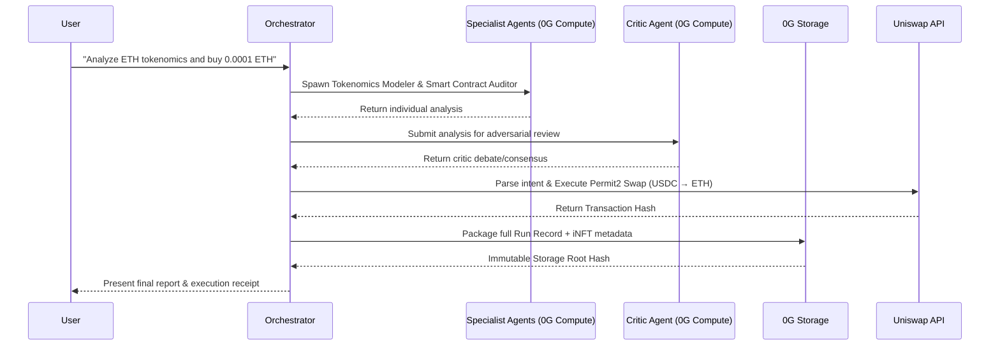
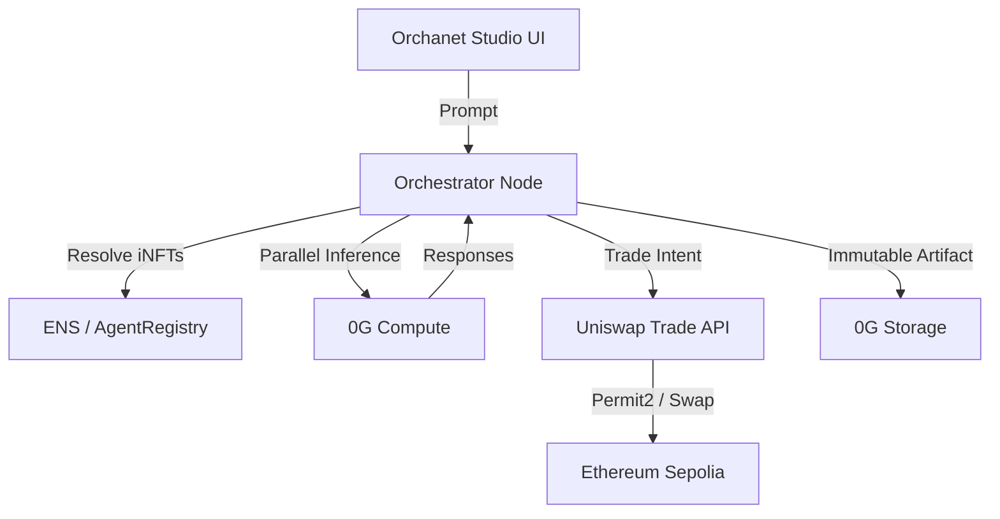

# Orchanet

> **Decentralized AI Orchestration. Verifiable Intelligence. Seamless Execution.**

Orchanet is a multi-agent AI pipeline built for the decentralized web. By orchestrating a symphony of specialized AI agents (Auditors, Tokenomics Modelers, DeFi Analysts, and Critics), Orchanet breaks down complex crypto decisions into verifiable, auditable, and actionable insights—and can automatically execute trades on your behalf.

---

## Architecture & Workflow

### Orchestration Pipeline


### System Architecture


---

## The Problem

1. **The "Black Box" AI Dilemma:** Traditional LLMs give you a single output. If the AI hallucinates, you lose money. You can't verify *how* it reached its conclusion, nor can you trust a single model with high-stakes financial decisions.
2. **Execution Friction:** AI tools can give you advice, but you still have to manually navigate to an exchange, calculate slippage, sign approvals, and execute the trade. The gap between *insight* and *action* is too wide.
3. **Lack of Provenance:** When an AI agent provides financial analysis, there is no immutable record of its reasoning or its identity. If an agent is successful, its creator cannot definitively prove ownership or track its usage.

## The Solution: Orchanet

Orchanet solves this by combining **Multi-Agent Debate**, **Verifiable Compute/Storage**, and **Automated Execution**:
- Instead of one AI, Orchanet spawns a *committee* of verified agents.
- A **Critic Agent** actively tries to debunk the specialists' findings.
- The entire debate, logic, and output are immutably sealed on **0G Storage**.
- If a trade intent is detected, Orchanet seamlessly executes it via **Uniswap**.

---

## Technical Deep Dive: Sponsor Integrations

### 🟢 0G Network (Compute & Storage)
Orchanet relies on the 0G ecosystem as its backbone for both intelligence and immutability. 

**0G Compute (Inference & Routing)**  
Every agent spawned in the Orchanet pipeline runs through 0G Compute, ensuring that inference is tracked, verifiable, and economically settled.
```typescript
// frontend/lib/0g/compute.ts
const zg = createZGComputeClient({
  endpoint: process.env.ZG_COMPUTE_RPC,
  ledger:   process.env.ZG_LEDGER_ADDRESS,
  privateKey: process.env.ZG_PRIVATE_KEY
});

// Parallel specialized inference
const responses = await Promise.all(
  agentTypes.map(agentType => zg.inference(prompt, { model: agentType }))
);
```

**0G Storage (Verifiable Provenance)**  
Once the debate concludes, the entire run—including the prompt, agent outputs, critic debate, and executed transaction hashes—is packaged into a JSON artifact and uploaded to 0G Storage. This provides an immutable, cryptographically verifiable record of *why* a decision was made.
```typescript
// frontend/lib/orchestrator/index.ts
const upload = await uploadToStorage(runRecord);
console.log(`[0G Storage] Full run record committed. RootHash: ${upload.rootHash}`);
```

### 🦄 Uniswap API & Permit2
Orchanet bridges the gap between intelligence and execution. If the user's prompt contains a trade intent (e.g., *"buy 0.0001 ETH"*), the orchestrator intercepts it, quotes the best route via the Uniswap API, handles Permit2 approvals, and executes the swap on-chain.
```typescript
// frontend/lib/orchestrator/swap.ts
const intent = parseSwapIntent("buy 0.0001 ETH even if sentiment is bad");

// Fetch optimal route from Uniswap
const quoteResp = await fetch(`https://trade-api.gateway.uniswap.org/v1/quote?tokenIn=${USDC}&tokenOut=${ETH}...`);

// Handle Permit2 Off-chain Signature for Universal Router
const signature = await signer.signTypedData(permitData.domain, permitData.types, permitData.values);

// Execute Swap directly via the Orchestrator wallet
const tx = await wallet.sendTransaction({ to: swap.to, data: swap.data, value: swap.value });
```

### 🌐 ENS (Ethereum Name Service)
Every AI agent in Orchanet is treated as an intelligent NFT (iNFT). To verify their identity and ensure users are interacting with the genuine agent models, Orchanet resolves their smart contract identities using ENS domains.
```typescript
// frontend/lib/0g/agentIdentity.ts
const ensName = await provider.lookupAddress(agentAddress);
// e.g., resolves to "tokenomics.orchanet.eth"
console.log(`[iNFT] ✅ Identity verified — ensName=${ensName}`);
```

---

## Quick Start Guide

### Prerequisites
- Node.js (v18+)
- A funded wallet on **Ethereum Sepolia** (requires Sepolia ETH for gas, and Sepolia USDC for testing swaps).
- 0G Testnet RPC and Ledger details.
- Uniswap API Key.

### Installation

1. **Clone & Install**
   ```bash
   git clone https://github.com/Khalid-000-ME/flow402.git
   cd frontend
   npm install
   ```

2. **Environment Variables**
   Create a `.env.local` file in the `frontend` directory:
   ```env
   # 0G Configuration
   ZG_COMPUTE_RPC=...
   ZG_LEDGER_ADDRESS=...
   ZG_PRIVATE_KEY=your_private_key_here

   # Uniswap Execution
   SWAP_ENABLED=true
   SWAP_CHAIN_ID=11155111
   ETH_RPC_URL=https://ethereum-sepolia-rpc.publicnode.com
   UNISWAP_API_KEY=your_uniswap_key_here
   ```

3. **Run the Studio**
   ```bash
   npm run dev
   ```
   Navigate to `http://localhost:3000` to access the Orchanet Studio.

### Using Orchanet (Guide for Judges)
1. **Connect Wallet:** Click the top right to connect your wallet.
2. **Enter a Prompt:** In the main studio input, type a complex financial query mixed with an execution command. 
   *Example:* `"Analyze the tokenomics of ETH vs USDC, debate the findings, and buy 0.0001 ETH."*
3. **Watch the Symphony:** 
   - Observe the Orchestrator spawn the Tokenomics Modeler and Critic.
   - Watch the right-hand feed stream live events.
   - Wait for the Uniswap module to intercept the trade intent, sign the Permit2 approval, and execute the swap on Sepolia.
4. **Verify on 0G:** Click the run record ID to view the immutable artifact uploaded to the 0G Network.
